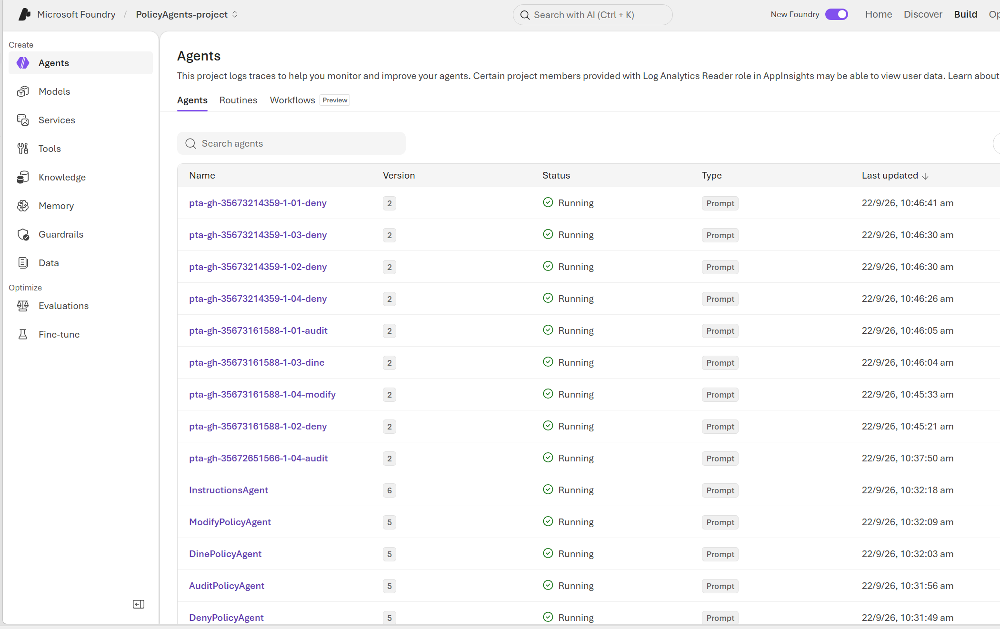
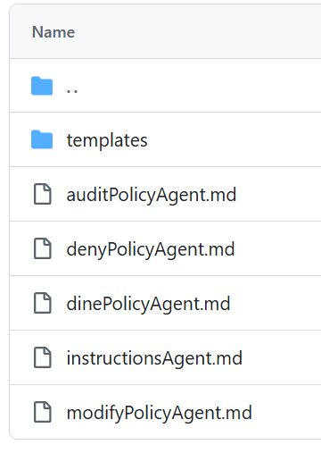
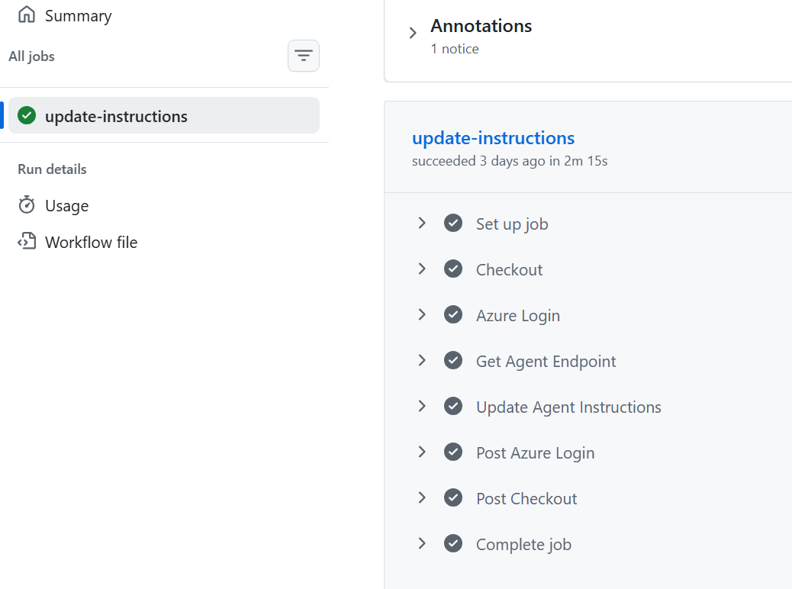
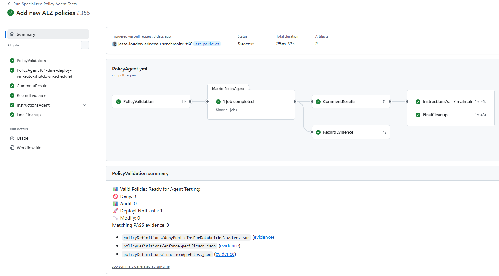
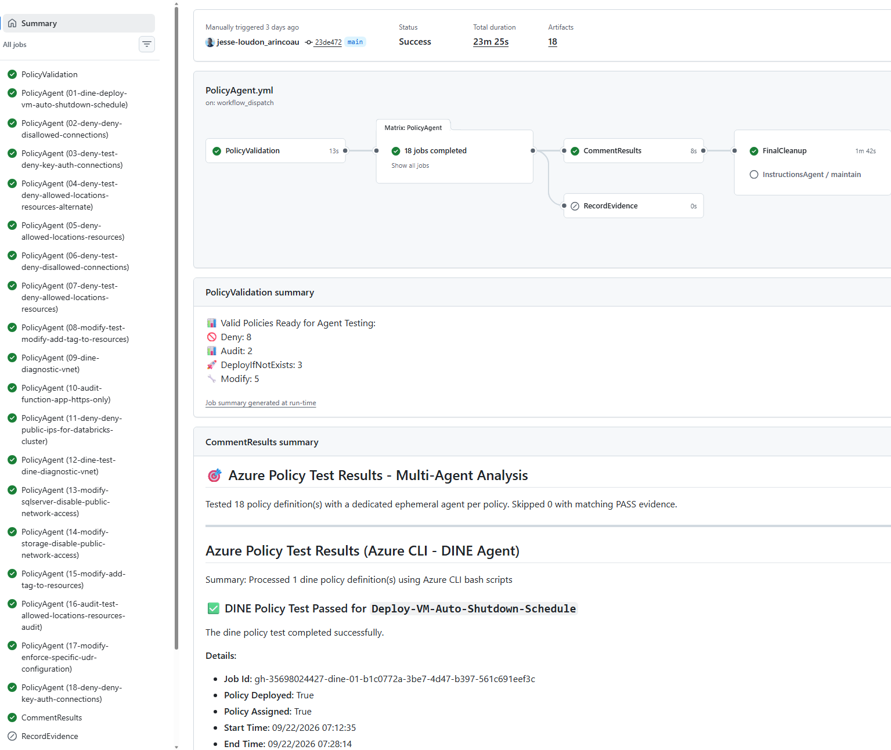
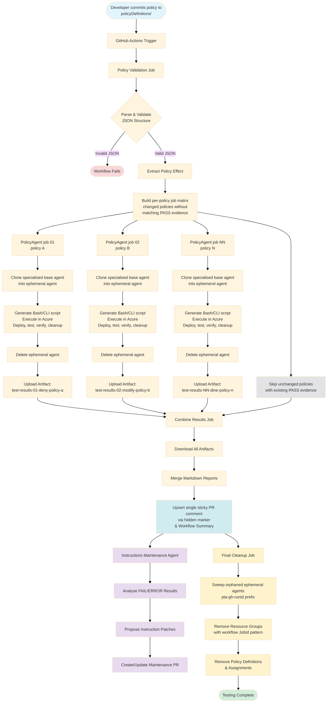

# Azure Policy Agents

A comprehensive toolkit for automated Azure Policy development, testing, and validation using GitHub Actions and Azure AI Foundry agents.

> **🚀 Ready to get started?** Follow our [Getting Started Guide](docs/Getting-Started.md) for step-by-step setup instructions.

## 🚀 Overview

Azure Policy Agents streamlines the Azure Policy development lifecycle by providing:

- **Automated Policy Testing**: GitHub Actions workflow that automatically deploys and tests Azure Policy definitions
- **AI-Powered Validation**: Uses Azure AI Foundry agents to generate intelligent test scenarios and validate policy behavior
- **Infrastructure as Code**: Bicep templates for deploying policies and AI infrastructure
- **Local Development Support**: Integration with VS Code through [Model Context Protocol (MCP) Server for Azure Resource Graph](https://insiders.vscode.dev/redirect/mcp/install?name=Azure%20Resource%20Graph&config=%7B%22command%22%3A%22npx%22%2C%22args%22%3A%5B%22-y%22%2C%22@krnese/azure-resource-graph-mcp@latest%22%5D%2C%22env%22%3A%7B%22AZURE_SUBSCRIPTION_ID%22%3A%22YOUR_SUBSCRIPTION_ID%22%7D%7D)

    > **⚠️ Important:** Replace `YOUR_SUBSCRIPTION_ID` in the VS Code configuration after installation with your actual Azure Subscription ID.) for policy development, authoring, Azure resource interaction, and best practices for security, compliance, and governance.

### 🎯 Supported Policy Effects

| Effect | Status | Description |
|--------|--------|-------------|
| **Deny** | ✅ Supported | Prevents non-compliant resource deployments |
| **Audit** | ✅ Supported | Logs compliance violations without blocking deployments |
| **Modify** | ✅ Supported | Automatically modifies resources to ensure compliance |
| **AuditIfNotExists** | ✅ Supported | Audits when related resources don't exist |
| **DeployIfNotExists** | ✅ Supported | Automatically deploys missing required resources |

## ✨ Key Features

- **🔄 Automated GitHub Workflows**: Deploy and test policies on PR creation with AI-powered analysis
- **🤖 AI-Powered Policy Analysis**: Generate intelligent test scenarios and validate policy behavior
- **🛠️ Development Tools**: Bicep templates, PowerShell utilities, and VS Code integration
- **📊 Detailed Reporting**: Comprehensive feedback on policy effectiveness and best practices

## 🌟 Key Enhancements

### Multi-Agent Architecture

Five specialised AI agents run within a single Azure AI Foundry project. The [Deny Policy Agent](agentInstructions/denyPolicyAgent.md) validates resource blocking, the [Audit Policy Agent](agentInstructions/auditPolicyAgent.md) tests compliance flagging without blocking deployments, the [Modify Policy Agent](agentInstructions/modifyPolicyAgent.md) handles property modification scenarios, and the [DeployIfNotExists (DINE) Agent](agentInstructions/dinePolicyAgent.md) manages deployment testing with managed identities and role assignments. A fifth [Instructions Maintenance Agent](agentInstructions/instructionsAgent.md) analyses test failures and proposes patches to agent instructions via maintenance PRs.

At test time, each specialised agent is cloned into a short-lived, per-policy ephemeral agent that is deleted once that policy completes — enabling every policy in a pull request to be tested in parallel.



### Markdown-Based Agent Instructions

Agent instructions are authored in readable Markdown files with automated conversion to JSON for deployment, giving clear syntax highlighting and Git diff visibility. [build-instructions.ps1](scripts/build-instructions.ps1) handles the Markdown-to-JSON build, and [extract-instructions.ps1](scripts/extract-instructions.ps1) can reverse-engineer instructions from an already-deployed agent.



### Automated Deployment Pipeline

Changes to agent instructions deploy automatically through [update-agent-instructions.yml](.github/workflows/update-agent-instructions.yml), performing zero-downtime updates against existing agent IDs. Infrastructure is managed through [Bicep templates](infra/bicep/agentsSetup.bicep) via [deploy-specialized-agents.yml](.github/workflows/deploy-specialized-agents.yml). After tests complete, [instructions-agent.yml](.github/workflows/instructions-agent.yml) can analyse failures and propose instruction improvements via maintenance PRs.



### Production-Grade Reliability

Every generated test script uses a `trap cleanup EXIT` pattern to guarantee resource cleanup even on failure, unique JobId-based naming prevents test conflicts across concurrent runs, and all agent types emit standardized JSON logging.



### Microsoft Sponsored Subscription Compatibility

Test resources are generated to comply with sponsored subscription limitations — Basic/Standard SKUs only, B-series or `Standard_DS1_v2` VM size limits, `Standard_LRS` storage, and Australian region requirements.

### Advanced Testing Capabilities

Parameter extraction and validation for parameterized policies, managed identity testing for DINE and Modify policies, and configurable compliance-state timeouts are all handled automatically. All policy testing runs through Azure CLI/Bash via [test-policies-cli.ps1](scripts/test-policies-cli.ps1) for consistent, cross-platform execution.



### Developer Tools

- [build-instructions.ps1](scripts/build-instructions.ps1) — Markdown → JSON instruction build
- [extract-instructions.ps1](scripts/extract-instructions.ps1) — pull instructions from deployed agents
- [deploySpecializedAgents.ps1](scripts/deploySpecializedAgents.ps1) — deploy/update all agents at once
- [test-policies-cli.ps1](scripts/test-policies-cli.ps1) — sequential/multi-policy batch testing orchestration

## 📁 Project Structure

```
AzurePolicyAgents/
├── .github/
│   ├── copilot-instructions.md           # Copilot policy authoring rules
│   └── workflows/
│       ├── PolicyAgent.yml               # Main policy testing pipeline
│       ├── deploy-specialized-agents.yml # Infrastructure deployment
│       ├── instructions-agent.yml        # Agent self-improvement workflow
│       └── update-agent-instructions.yml # Agent instruction updates
├── agentInstructions/                    # Agent instructions (Markdown source)
│   ├── auditPolicyAgent.md
│   ├── denyPolicyAgent.md
│   ├── dinePolicyAgent.md
│   ├── instructionsAgent.md
│   ├── modifyPolicyAgent.md
│   └── templates/                        # JSON build templates per agent
├── infra/
│   └── bicep/
│       └── agentsSetup.bicep             # Deploys AI Foundry project and 5 agents
├── scripts/
│   ├── build-instructions.ps1            # Markdown → JSON instruction build
│   ├── deploySpecializedAgents.ps1       # Deploy/update all agents
│   ├── extract-instructions.ps1          # Pull instructions from deployed agents
│   ├── get-changed-files.sh              # File change detection
│   ├── instructions-agent.ps1            # Instructions Maintenance Agent runner
│   ├── manage-test-agent.ps1             # Clone/delete ephemeral test agents
│   ├── test-policies-cli.ps1             # Azure CLI/Bash policy test orchestration
│   ├── update-evidence-log.ps1           # Evidence-based skip tracking
│   └── validate-policies.ps1             # Policy JSON structure validation
├── pipelines/                            # Azure DevOps pipeline equivalents
├── policyDefinitions/                    # Azure Policy definitions (production + test)
└── docs/
    ├── Getting-Started.md                # Setup and usage guide
    ├── JobId-Tagging.md
    ├── Scripts-Reference.md
    ├── Test-Evidence.md
    └── media/
```

## 🚀 Quick Start

1. **Use this repository as a template** to create your own Azure Policy Agents repository
2. **Deploy the Azure AI infrastructure** using the provided Bicep templates  
3. **Configure GitHub authentication** with federated identity credentials
4. **Add your policy definitions** to the `policyDefinitions/` folder
5. **Create pull requests** to automatically test your policies

**Prerequisites**: Azure subscription with Owner permissions, Azure CLI or PowerShell

📖 **[Complete Setup Guide](docs/Getting-Started.md)** - Step-by-step instructions with commands and screenshots

## 🔧 How It Works

### Workflow Architecture

```
Pull Request with Policy Changes
    ↓
PolicyValidation Job
    ├── Detect changed JSON files in policyDefinitions/
    ├── Validate policy syntax and structure
    ├── Skip policies with existing PASS evidence (unchanged content hash)
    └── Build a per-policy job matrix for changed/untested policies
    ↓
Per-Policy PolicyAgent Jobs (parallel, up to 10 concurrent)
    ├── Clone the matching specialised agent into an ephemeral agent
    ├── Generate and execute a Bash/Azure CLI test script (deploy, test, verify)
    ├── Delete the ephemeral agent
    └── Upload the policy's test result artifact
    ↓
Combine Results Job
    ├── Merge all test result artifacts
    ├── Upsert a single sticky PR comment (updated in place across runs)
    └── Trigger the Instructions Maintenance Agent on failures
```

### Key Components

- **PolicyAgent.yml**: Main GitHub Actions workflow — validates policies, fans out per-policy test jobs, aggregates results
- **deploy-specialized-agents.yml**: Deploys/updates the Azure AI Foundry infrastructure and the five specialised agents
- **instructions-agent.yml**: Runs the Instructions Maintenance Agent against failed tests and opens maintenance PRs
- **validate-policies.ps1**: Validates policy JSON structure ahead of agent testing
- **test-policies-cli.ps1**: Orchestrates Azure CLI/Bash policy testing against the ephemeral agents
- **manage-test-agent.ps1**: Clones and deletes the per-policy ephemeral agents
- **update-evidence-log.ps1**: Tracks pass/fail evidence so unchanged, already-passing policies are skipped
- **agentsSetup.bicep**: Bicep template deploying the AI Foundry project, agents, and supporting infrastructure

**Triggers**: Pull requests with changes to `policyDefinitions/*.json` files, or manual `workflow_dispatch` (which also forces a retest of all selected policies)

### Testing Workflow



**Validation (30 seconds)** - JSON structure validation, policy effect detection, evidence-based skipping of unchanged policies that already have `PASS` evidence, and construction of the per-policy job matrix

**Parallel Testing (3-21 minutes per policy)** - Every changed policy runs in its own job against its own ephemeral agent that is created for the job and deleted when it finishes, so policies of the same effect are tested concurrently. Deny policies complete in approximately 3-6 minutes; Modify policies in 4-7 minutes; Audit policies in 11-12 minutes; and DINE policies in 9-21 minutes including propagation and evaluation time. Up to 10 policy jobs run concurrently.

**Results Aggregation (10 seconds)** - Download test artifacts, combine results, and upsert a single sticky pull request comment plus the workflow summary. A final cleanup job sweeps any orphaned ephemeral agents and removes the resource groups, policy definitions, and assignments created during the run.

## 🧪 Usage

### Adding Policy Definitions

1. Create JSON policy definition files in the `policyDefinitions/` folder
2. Commit your changes and create a pull request
3. The workflow will automatically deploy and test your policies
4. Review AI-generated feedback in the PR comments

### Example Policy

```json
{
  "properties": {
    "displayName": "Allowed locations for resources",
    "policyType": "Custom",
    "mode": "Indexed", 
    "description": "This policy restricts the locations where resources can be deployed",
    "parameters": {
      "listOfAllowedLocations": {
        "type": "Array",
        "defaultValue": ["eastus", "westus2"]
      }
    },
    "policyRule": {
      "if": {
        "not": {
          "field": "location", 
          "in": "[parameters('listOfAllowedLocations')]"
        }
      },
      "then": {
        "effect": "deny"
      }
    }
  }
}
```

### Example AI Feedback

```markdown
## Azure Policy Test Results

### ✅ Policy Test Completed Successfully for `allowed-locations.json`
The Policy 'Allowed locations for resources' successfully validated.

**Details:**
- Policy correctly blocks resource deployment to unauthorized regions
- Test scenarios confirmed expected deny behavior  
- No syntax or logic issues detected
```

## 🔧 Configuration

The workflow requires these secrets and variables in your GitHub repository:

**Required Secrets** (from Bicep deployment outputs):
- `AZURE_CLIENT_ID` - User-Assigned Managed Identity Client ID
- `AZURE_TENANT_ID` - Azure AD Tenant ID  
- `AZURE_SUBSCRIPTION_ID` - Target Azure Subscription ID

**Required Variables** (from Bicep deployment outputs):
- `AGENT_ENDPOINT` - Azure AI Foundry Project Endpoint
- `DENY_AGENT_ID`, `AUDIT_AGENT_ID`, `DINE_AGENT_ID`, `MODIFY_AGENT_ID` - Specialised policy testing agent IDs
- `INSTRUCTIONS_AGENT_ID` - Instructions Maintenance Agent ID

**Authentication**: Uses federated identity credentials (workload identity federation) with a user-assigned managed identity

For complete configuration instructions, see the [Getting Started Guide](docs/Getting-Started.md).

## ⚡ Performance and Scalability

- **500 TPM Model Capacity**: supports parallel processing across policy jobs
- **Parallel Policy Testing**: one ephemeral agent per policy, up to 10 policies tested concurrently
- **Exponential Backoff**: retry logic with jitter prevents API throttling
- **Extended Timeouts**: 30-minute workflow timeout supports large policy batches

**Benchmarks (from recent runs)**:
- Total pipeline time is gated by the slowest policy in each 10-job concurrency wave, not by the raw policy count
- Batch of 4 policies (one per effect): ~25 minutes total, bound by the DINE job (~20 minutes)
- Batch of 18 policies (10 concurrent plus a queued remainder): ~23 minutes total
- Deny/Modify-only batches finish in well under 10 minutes; batches containing Audit or DINE policies are bound by those longer-running effects

The `agentModelCapacity` parameter in [agentsSetup.bicep](infra/bicep/agentsSetup.bicep) controls TPM allocation (range: 10–1000, default: 500).

## 📊 Monitoring and Costs

### What to Monitor

- **GitHub Actions**: Check workflow execution in the Actions tab
- **Azure Costs**: Monitor AI Foundry usage and compute costs
- **Policy Deployments**: Track deployed policies in Azure Policy portal
- **Resource Usage**: Monitor any test resource creation/deletion

### Cost Optimization

- **AI Usage**: AI agents only run when policies are changed in PRs
- **Resource Cleanup**: Test resources are automatically cleaned up after testing
- **Efficient Triggers**: Workflow only processes changed policy files

## � Resource Management

All test resources are tagged with `CreatedBy=GitHubActions` and a unique JobId, making them easy to identify. Cleanup runs automatically after test completion, with a fail-safe that removes resources even if an agent run fails. A final cleanup job also sweeps any orphaned ephemeral agents (`pta-gh-*` prefix) left behind by cancelled or timed-out jobs, and removes the resource groups, policy definitions, and assignments created during the run — so no residual cost or leftover agents accumulate between runs.

## 📋 Test Results

Each test run produces:
- Policy deployment validation confirming the policy was created successfully
- Compliance testing scenarios validating expected policy behavior
- Resource creation/modification verification against expected outcomes
- Cleanup confirmation that all test resources were removed
- Detailed Bash execution logs
- Recommendations for policy improvements based on observed behavior

## �🤝 Contributing

We welcome contributions! Please see our [Contributing Guide](CONTRIBUTING.md) for details.

### Development Workflow

1. Fork the repository
2. Create a feature branch: `git checkout -b feature/your-feature`
3. Make your changes and test with sample policies
4. Ensure your changes work with the GitHub Actions workflow
5. Commit your changes: `git commit -m 'Add some feature'`
6. Push to the branch: `git push origin feature/your-feature`
7. Submit a pull request

## 🐛 Troubleshooting

### Common Issues

- **Authentication Failures**: Verify your managed identity Client ID and federated credentials
- **Permission Errors**: Ensure Contributor permissions on the target subscription
- **AI Agent Issues**: Check that your `*_AGENT_ID` variables and `AGENT_ENDPOINT` are correct
- **Policy Deployment Failures**: Review Bicep template logs and policy JSON structure

For detailed troubleshooting, see the [Getting Started Guide](docs/Getting-Started.md).

## 📚 Documentation

- [Getting Started Guide](docs/Getting-Started.md) - Complete setup and usage instructions
- [Contributing Guide](CONTRIBUTING.md) - How to contribute to the project  
- [Security Policy](SECURITY.md) - Security guidelines and reporting

## 🌟 Current Limitations

- Only supports JSON policy definition files in `policyDefinitions/` folder  
- Requires setup of Azure AI Foundry infrastructure via Bicep deployment
- AI-generated tests execute real Azure CLI deployments and may not cover every real-world edge case
- Limited to pull request and manual `workflow_dispatch` triggers
- Requires federated identity configuration for each repository

## 📄 License

This project is licensed under the MIT License - see the [LICENSE](LICENSE) file for details.

## 🙋‍♀️ Support

- **Issues**: Report bugs and request features via [GitHub Issues](https://github.com/Azure/AzurePolicyAgents/issues)
- **Discussions**: Join conversations in [GitHub Discussions](https://github.com/Azure/AzurePolicyAgents/discussions)
- **Documentation**: Start with our [Getting Started Guide](docs/Getting-Started.md)

## 🌟 Acknowledgments

- Microsoft Azure Policy team
- VS Code MCP community
- Contributors and maintainers

---

**Made with ❤️ for the Azure Policy community**
