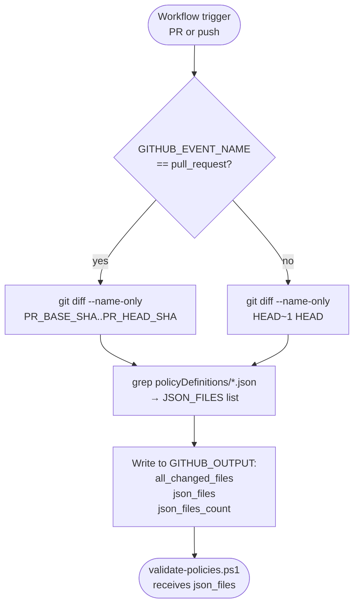
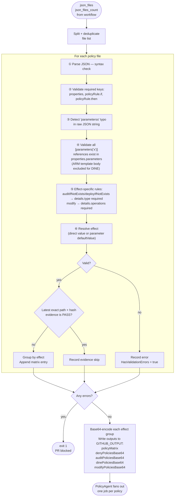
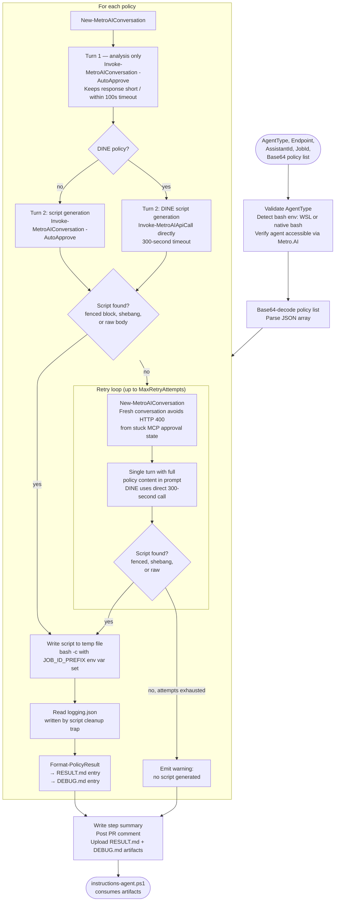
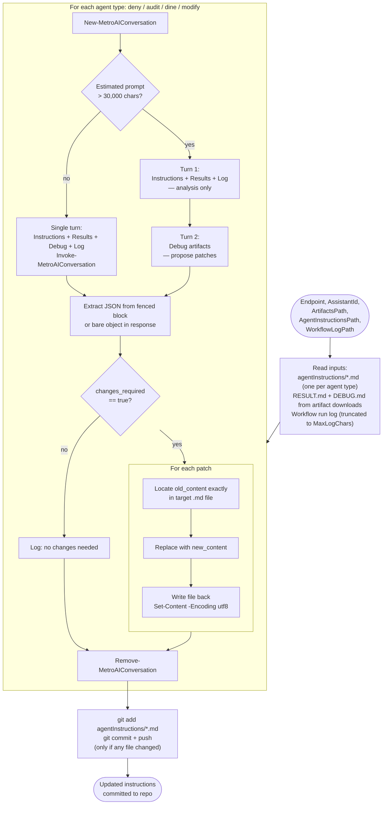

# `scripts/` — Script Reference

This folder contains all CI/CD, deployment and build scripts used by the policy-agent, instructions-agent and deployment workflows and pipelines. The CI/CD helper scripts are documented in detail below.

---

## `get-changed-files.sh`

Detects which `policyDefinitions/*.json` files changed in the current push or pull request and emits them as workflow outputs.

**Inputs:** `$GITHUB_EVENT_NAME`, `$PR_BASE_SHA`, `$PR_HEAD_SHA`
**Outputs:** `json_files`, `json_files_count`

---

## `validate-policies.ps1`

Validates every changed policy JSON file for structural correctness, groups valid policies by effect type, and emits a per-policy job matrix so each policy is tested in its own parallel job. Exits `1` on any validation failure, blocking the PR.

**Inputs:** `-JsonFiles`, `-JsonFilesCount`, optional `-EvidenceFiles`, and optional `-ForceRetest`
**Outputs:** `policyMatrix`, `denyPoliciesBase64`, `auditPoliciesBase64`, `dinePoliciesBase64`, `modifyPoliciesBase64`, `skippedByEvidenceCount`, `skippedByEvidenceBase64` + counts

When evidence files are supplied, validation still runs for every policy. Agent testing is omitted
only when the latest record for the same policy path and canonical content hash is `PASS`.
`-ForceRetest $true` disables this filter.

`skippedByEvidenceBase64` is a base64 encoded JSON array describing each skipped policy
(`file`, `policyName`, `effect`, `agentType`, `contentHash`, `result`, `testedAt`, `runUrl`).
The `CommentResults` job decodes it to list skipped policies in the pull request comment,
because skipped policies produce no test artifact.

`policyMatrix` is a compact JSON array consumed by `fromJSON()` in the `PolicyAgent` job matrix. Each entry contains:

| Field | Description | Example |
| --- | --- | --- |
| `index` | Two digit, one based position in the matrix | `03` |
| `file` | Repository relative path to the policy definition | `policyDefinitions/allowedLocations.json` |
| `policyName` | `name` from the policy definition | `Allowed-Locations-Resources` |
| `effect` | Resolved effect value | `deployifnotexists` |
| `agentType` | Specialized agent that tests this effect | `dine` |
| `slug` | Unique job, artifact and agent naming token | `03-dine-diagnostic-vnet` |

The per-effect Base64 outputs are retained for the repository's Azure DevOps parity pipeline (`pipelines/policy-agent.yml`), which still tests one batch per effect for teams mirroring the GitHub Actions workflow in Azure DevOps.

---

## `manage-test-agent.ps1`

Manages the lifecycle of ephemeral Foundry test agents. Each `PolicyAgent` job clones its specialized base agent into a uniquely named agent, tests one policy with it, then deletes it.

| Action | Purpose |
| --- | --- |
| `Create` | Clones `-BaseAgentId` into `-AgentName`, copying model, instructions, MCP tool configuration and reasoning effort. Writes the created agent ID to `GITHUB_OUTPUT`. |
| `Delete` | Removes a single ephemeral agent by `-AgentId` or `-AgentName`. Non-fatal on failure. |
| `Sweep` | Deletes every agent whose name starts with `-NamePrefix`. Used by `FinalCleanup` as a fail-safe for cancelled or timed out jobs. |

Ephemeral agent names follow `pta-gh-{runId}-{runAttempt}-{policyIndex}-{agentType}`. The run attempt is included so a re-run cannot collide with an agent orphaned by a previous attempt.

---

## `test-policies-cli.ps1`

Agent-driven test runner. In GitHub Actions it is invoked once per policy against a dedicated ephemeral agent; the Azure DevOps pipeline still invokes it once per effect with a Base64-encoded list. For each policy it asks the agent to generate a bash test script, executes it, and formats the results.

**Key parameters:** `-Endpoint`, `-AssistantId`, `-AgentType`, `-JobId`, `-MaxRetryAttempts`

**Script extraction (`Get-ScriptFromText`):** The agent response is parsed for a runnable script in this order: an explicit `powershell`/`bash` fenced block, any fenced block with language inferred from content, a raw body starting at a `#!` shebang line, then an un-fenced body detected by PowerShell or bash signals. Agents commonly return the script body directly without a markdown fence, so shebang and raw-body detection prevent false "no script generated" results.

---

## `instructions-agent.ps1`

Post-test self-improvement script. After a PR test run completes, this script calls the `InstructionsAgent` to analyse results and propose patches to the agent instruction markdown files.

**Key parameters:** `-Endpoint`, `-AssistantId`, `-ArtifactsPath`, `-AgentInstructionsPath`, `-WorkflowLogPath`, `-MaxLogChars`

**Secret guard:** Before any proposed patch is written, `Get-SecretMatch` scans the patch `new_content` for credential-shaped values (hex strings of 32 or more characters, assigned `key`/`secret`/`password`/`token`/`connectionString` values, storage `AccountKey=...`, AWS `AKIA...` keys, and `eyJ...` JWTs). A match rejects that patch and records it in the maintenance summary; obvious placeholders containing `FAKE`, `PLACEHOLDER`, `REPLACE`, `EXAMPLE`, or `REDACTED` are allowed. This prevents the maintenance agent from committing a real or realistic-looking secret into `agentInstructions/*.md`.
